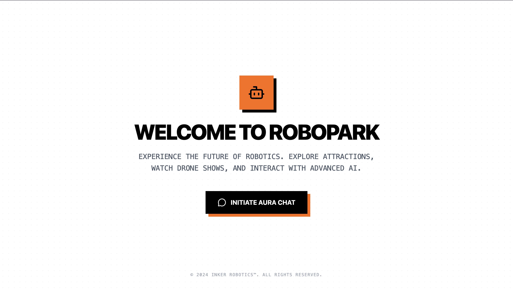
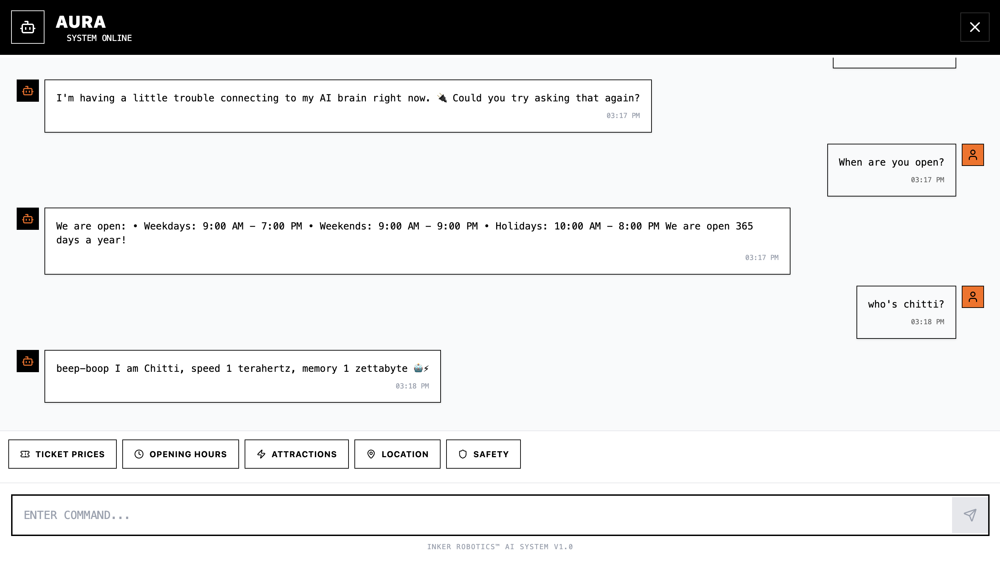

# 🤖 Aura - RoboPark's Chatbot

**Copyright © 2024 Inker Robotics™. All Rights Reserved.**  
**Developed by:** Prathyush N M

An AI-powered visitor assistant for RoboPark by Inker Robotics™, featuring both rule-based responses and advanced AI capabilities for complex queries.





---

## ⚖️ License & Usage

**PROPRIETARY SOFTWARE - ALL RIGHTS RESERVED**

This project is the exclusive property of **Inker Robotics™** and is protected under copyright law.

- ✅ **Viewing** for educational purposes is permitted
- ✅ **Reference** for learning and study
- ✅ **Portfolio demonstration** with proper attribution to Prathyush N M and Inker Robotics™
- ❌ **Commercial use** strictly prohibited without written permission
- ❌ **Redistribution or modification** not allowed
- ❌ **Use for competing businesses** prohibited

# 🤖 Aura - RoboPark Intelligent Chatbot

> An advanced, intelligent chatbot system for **RoboPark** by **Inker Robotics™**


Aura is a modern, intelligent chatbot designed to assist visitors at RoboPark, India's first dedicated robotics and technology park in Thrissur, Kerala.

## 🚀 Quick Start

### Prerequisites

- Node.js (v18+)
- npm or yarn

### Installation

1. **Clone the repository**
   ```bash
   git clone https://github.com/probablynotnmp/aura-robopark-chatbot.git
   cd aura-robopark-chatbot
   ```

2. **Install dependencies**
   ```bash
   npm install
   ```

3. **Configure environment** (Optional for AI features)
   ```bash
   cp .env.example .env
   ```
   
   Edit `.env` and add your Groq API key:
   ```
   VITE_GROQ_API_KEY=your_groq_api_key_here
   ```
   
   > 🔑 Get a free Groq API key at [console.groq.com](https://console.groq.com/keys)

4. **Run the development server**
   ```bash
   npm run dev
   ```

5. **Open in browser**
   ```
   http://localhost:5173
   ```

## 🎯 Usage Modes

### 🤖 With AI (Recommended)

Add your Groq API key to `.env` for intelligent responses to complex queries:
- ✅ Rule-based responses for common questions
- ✅ AI-powered answers for complex or unknown queries
- ✅ Contextual conversation with chat history

### 📋 Without AI (Rule-Based Only)

Works without an API key using pre-programmed responses:
- ✅ Intent detection for common queries
- ✅ Knowledge base responses
- ✅ Content moderation
- ❌ Limited to predefined answers

## 📁 Project Structure

```
aura-robopark-chatbot/
├── src/
│   ├── components/
│   │   ├── Chatbot.jsx          # Main chat interface
│   │   ├── MessageBubble.jsx    # Message display
│   │   └── QuickActions.jsx     # Quick reply buttons
│   ├── data/
│   │   └── knowledgeBase.js     # RoboPark information
│   ├── utils/
│   │   ├── intentDetector.js    # Pattern matching
│   │   ├── responseGenerator.js # Rule-based logic
│   │   ├── contentFilter.js     # Safety moderation
│   │   └── apiHandler.js        # Groq API integration
│   ├── App.jsx                  # Landing page
│   ├── main.jsx                 # Entry point
│   └── index.css                # Tailwind imports
├── .env.example                 # Environment template
├── LICENSE                      # Proprietary license
└── README.md                    # This file
```

## 🎨 Tech Stack

- **Framework**: React 19 + Vite 7
- **Styling**: Tailwind CSS v4
- **Icons**: Lucide React
- **AI**: Groq API (Llama 3.1 8B Instant)
- **Markdown**: React Markdown

## 📄 License

**Proprietary License** - This software is NOT open source.

© 2024 **Inker Robotics™**. All rights reserved.

This project is proprietary software owned by Inker Robotic Solutions Private Limited. Unauthorized copying, modification, distribution, or use of this software is strictly prohibited. See [LICENSE](LICENSE) for full terms.

## 🏢 About

**RoboPark** is India's first dedicated robotics and technology park, developed by **Inker Robotics** in partnership with Kerala Startup Mission (KSUM) and Thrissur District Panchayat.

**Developed by**: [Inker Robotics](https://inkerrobotics.com)  
**Location**: Thrissur, Kerala, India  
**Contact**: info@inkerrobotics.com | +91 90615 00800

---

1. **Profanity Filter:** Blocks offensive language
2. **Topic Filter:** Rejects irrelevant questions
3. **Family-Friendly Guard:** Maintains appropriate tone

**Made with 🧡 for RoboPark visitors by Prathyush N M**
